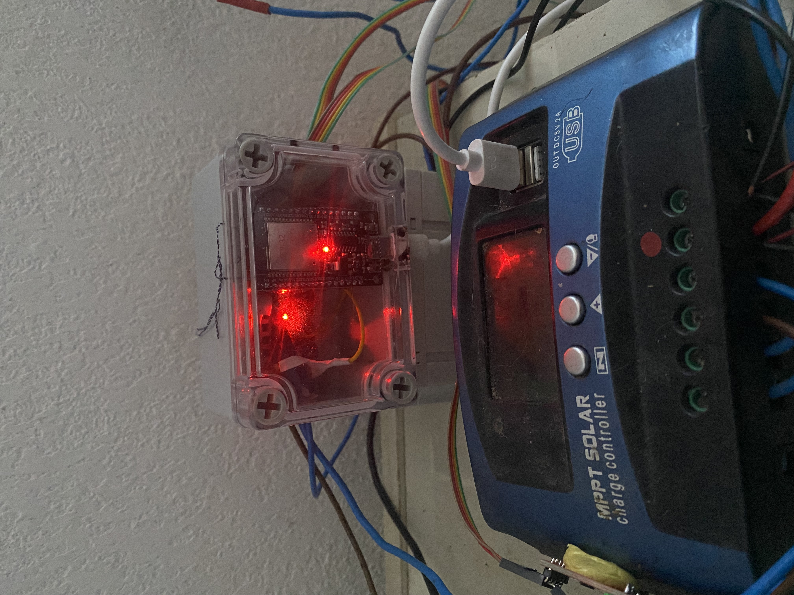
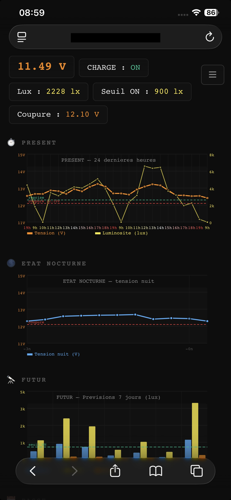

# ESP32 Smart Solar Controller — MPPT Firmware + Web Dashboard

> **Turn your cheap MPPT into a smart solar controller.**

An ESP32-based add-on module that plugs into any 12V MPPT charge controller and gives it a brain — real-time web dashboard, weather-adaptive cutoff, coulomb counting, remote access, and deep sleep.

**Actually up & running** — built and battle-tested on a real 2-panel home installation.

---


*ESP32 module in transparent enclosure, sitting on top of the MPPT charge controller*


*Live web dashboard — accessible locally or from anywhere via DuckDNS + free VPS*

---

## ✨ Features

- **Automatic load control** — cuts and resumes based on battery voltage + sunlight
- **Weather-adaptive thresholds** — pulls OpenWeatherMap + NASA POWER data to dynamically adjust cutoff voltage and lux threshold
- **SOC tracking** — coulomb counting via INA226 (Ah in / Ah out)
- **Deep sleep** — wakes periodically at night for battery voltage checks (~10µA in sleep)
- **Full web dashboard** — live gauges, 24h charts, 30-day log, 7-day forecast, night voltage history
- **Remote access** — accessible from anywhere via DuckDNS + free Oracle Cloud VPS (optional)
- **Anti-bootloop protection** — detects overload reboot loops, locks MOSFET OFF automatically
- **15 languages** — EN, FR, DE, ES, IT, PT, PL, CZ, ZH, RU, JA, KO, NL, TR, SV

---

## 🔧 Hardware (BOM)

All parts under **€5 each on AliExpress**:

| Component | Role | ~Price |
|-----------|------|--------|
| ESP32 DevKit v1 | Main controller | ~€3 |
| INA226 | Current + voltage sensor (I²C) | ~€2 |
| VEML7700 | Lux sensor (I²C) | ~€2 |
| AOD4184 N-channel MOSFET | Load switching | ~€1 |
| 150kΩ + 33kΩ resistors | Voltage divider | <€1 |
| Transparent ABS enclosure | Housing | ~€3 |

**Total hardware cost: ~€12**

Full BOM with sourcing links, wiring diagram and assembly guide included in the [illustrated PDF documentation](https://akgaze5.gumroad.com/l/wjevp).

---

## 📡 Wiring overview

```
Solar panels
    └── MPPT charge controller
            ├── Battery terminals  ──── INA226 (shunt, I²C on GPIO 19/23)
            ├── Load terminals     ──── MOSFET (AOD4184, GPIO 18)
            └── USB 5V out         ──── ESP32 VIN

ESP32
    ├── GPIO 21/22  ── VEML7700 (lux, I²C Wire0)
    ├── GPIO 34     ── Voltage divider (150kΩ / 33kΩ)
    └── GPIO 2      ── LED indicator (optional)
```

> ⚠️ GND must be common between ESP32 and MPPT for voltage readings to be valid.

---

## 🚀 Quick Start

1. **Install Arduino IDE** and add ESP32 board support
2. **Install libraries**: `Preferences`, `WiFi`, `WebServer`, `Wire`, `HTTPClient`, `ArduinoJson`, `INA226_WE`, `VEML7700`
3. **Clone this repo** or download the source
4. Open `solar_ctrl_graphs_123f/solar_ctrl_graphs_123f.ino`
5. Set your WiFi credentials in the sketch
6. Select your language: replace `#include "lang_fr.h"` with your preferred `lang_XX.h`
7. Flash to your ESP32
8. On first boot, connect to the ESP32's AP and configure WiFi + location
9. Access the dashboard at `http://192.168.1.xxx` (or your configured static IP)

---

## 🌐 Web Interface

| Page | Description |
|------|-------------|
| `/` | Main dashboard — live data + all charts |
| `/config` | Settings — network, battery, light thresholds |
| `/debug` | System logs, reset reason, heap, uptime |
| `/debug/bilan` | 30-day Ah log debug view |
| `/doc` | Built-in documentation |
| `/live` | JSON endpoint — live voltage, lux, SOC |

---

## 🌍 Languages

Switch language with a single `#include` line:

```cpp
#include "lang/lang_en.h"   // English
#include "lang/lang_fr.h"   // Français
#include "lang/lang_de.h"   // Deutsch
#include "lang/lang_es.h"   // Español
#include "lang/lang_it.h"   // Italiano
#include "lang/lang_pt.h"   // Português
#include "lang/lang_pl.h"   // Polski
#include "lang/lang_cz.h"   // Čeština
#include "lang/lang_zh.h"   // 中文
#include "lang/lang_ru.h"   // Русский
#include "lang/lang_ja.h"   // 日本語
#include "lang/lang_ko.h"   // 한국어
#include "lang/lang_nl.h"   // Nederlands
#include "lang/lang_tr.h"   // Türkçe
#include "lang/lang_sv.h"   // Svenska
```

---

## 📦 What's in the full package (Gumroad)

The source code here is the complete firmware. The [Gumroad package (€9)](https://akgaze5.gumroad.com/l/wjevp) adds:

- 📄 **Illustrated PDF documentation** (15 pages, FR/EN)
- 🛒 **Full BOM** with AliExpress sourcing links
- 🔌 **Wiring diagrams** with photos
- ☁️ **Remote access setup guide** (DuckDNS + Oracle Cloud VPS + nginx)

---

## 📋 Version

**v1.23f** — ESP32 + VEML7700 + INA226 + MPPT

---

## ⚖️ License

**Proprietary Non-Commercial License** — see [LICENSE.txt](LICENSE.txt)

Personal and educational use permitted. Redistribution and commercial use prohibited without written permission.

© 2025 F.B — contact: fraise_prieres9v@icloud.com
